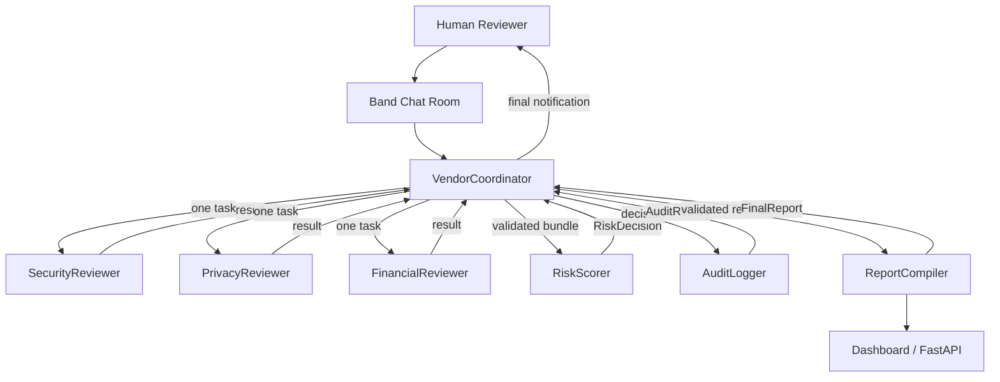

# VendorVigil — OlengSquad

**AI-Powered Vendor Risk Triage** — Multi-Agent, Band-Native, Fail-Closed, Cross-Framework  
*Band of Agents Hackathon 2026 — Track 1: Internal Enterprise*

---

## Architecture



### Technology Classification

| Component | Classification | Role |
|-----------|---------------|------|
| **Band** | Coordination layer | @mention routing, chat room, agent handoff |
| **Pydantic AI** | Agent framework (all 7 agents) | Structured output, type-safe agent logic |
| **FastAPI** | Dashboard API backend | v1 REST API, SSE streaming, health checks |
| **Gemini / Groq / OpenRouter** | Providers | Configurable per-agent model allocation |

### 7 Agents (Sequential Workflow)

| # | Agent | Role | Always Required |
|---|-------|------|-----------------|
| 1 | `VendorCoordinator` | State machine controller | Yes |
| 2 | `SecurityReviewer` | Security assessment | Routing-dependent |
| 3 | `PrivacyReviewer` | Privacy assessment | Routing-dependent |
| 4 | `FinancialReviewer` | Financial assessment | Routing-dependent |
| 5 | `RiskScorer` | Deterministic scoring + fail-closed rules | Yes |
| 6 | `AuditLogger` | Immutable audit record creation | Yes |
| 7 | `ReportCompiler` | Final report generation | Yes |

Workflow is **strictly sequential**: one agent active at a time, coordinator handles all transitions.
Specialists may be **SKIPPED** if not required by the routing plan.

---

## Project Structure

```
vendorvigil/
├── agents/                    # 7 Remote Agent definitions + specs/
├── api/
│   └── main.py                # FastAPI v1 backend
├── config/
│   ├── model_policy.yaml      # Model routing policy
│   └── scoring_rules.yaml     # Scoring weights & fail-closed rules
├── data/vendor_scenarios/     # 3 fictional vendor profiles
├── docs/
│   ├── architecture.md        # Architecture detail + Mermaid diagram
│   ├── demo_script.md         # 3-minute demo video script
│   └── submission_draft.md    # lablab.ai submission description
├── scripts/
│   └── package_release.py     # Release archive builder
├── tests/
│   ├── test_core.py           # Schema, scoring, golden path tests
│   ├── test_runtime_enforcement.py  # Guard, state, policy tests
│   └── test_adapter_integration.py  # Runtime send path verification
├── utils/
│   ├── schemas.py             # Pydantic schemas + AgentRole enum
│   ├── scoring.py             # Deterministic scoring engine
│   ├── partner_clients.py     # AI/ML API + Featherless clients
│   ├── audit_log.py           # Audit trail utility
│   ├── band_helpers.py        # Band Chat helpers
│   ├── handle_resolver.py     # Logical role -> Band handle mapping
│   ├── action_policy.py       # Role-based permission matrix
│   ├── inbound_guard.py       # Silence-by-default inbound routing
│   ├── outbound_guard.py      # Runtime recipient determination
│   ├── workflow_state.py      # Sequential state machine
│   ├── live_store.py          # File-based session store
│   ├── result_collector.py    # Markdown result parser
│   ├── cleanup.py             # CLI cleanup entry point
│   ├── cleanup_service.py     # Structured cleanup with retention
│   └── provider_preflight.py  # Provider credential/model checks
├── adapter.py                 # VendorVigilPydanticAdapter
├── config.py                  # Env, providers, model factories, MockModel
├── prompts.py                 # System prompts, AGENT_DEFS, spec loader
├── run_band_agents.py         # Band agent launcher (7 agents)
├── run_pipeline.py            # Local CLI pipeline runner
├── comprehensive_test.py      # 58-test quality gate
├── requirements.txt
├── .env.example
└── README.md
```

---

## Quick Start

### Prerequisites

```bash
pip install -r requirements.txt
```

### Configure Environment

```bash
cp .env.example .env
# Edit .env with your API keys
```

### Run Band Agents (Live Demo)

```bash
python3 run_band_agents.py
```

All 7 agents connect to Band Chat via WebSocket. Send:
```
@VendorCoordinator assess vendor CloudPayX
```

### Run API Server

```bash
python -m api.main
# REST API at http://localhost:8000
# Swagger UI at http://localhost:8000/docs
```

### Run Tests

```bash
python -m pytest tests/ -v
python comprehensive_test.py
```

---

## How It Works

### 1. Coordinator (`VendorCoordinator`)
Reads vendor profile, determines which specialists to invoke via RoutingPlan.
Creates workflow state and dispatches one agent at a time sequentially.

### 2. Sequential Specialists
- **SecurityReviewer**: SOC 2, ISO 27001, encryption, incident history
- **PrivacyReviewer**: DPA, data location, retention, cross-border safeguards
- **FinancialReviewer**: Years operating, funding, revenue, credit risk

Each specialist runs one at a time. Optional specialists are SKIPPED if not required.

### 3. Risk Scorer (`RiskScorer`)
Receives validated specialist assessments. Uses **deterministic scoring engine**
with weighted formula (security=35%, privacy=30%, financial=20%, evidence=15%).
Applies 7 **fail-closed rules** that can escalate status.

### 4. Audit Logger (`AuditLogger`)
Creates immutable audit record with unique VV-YYYY-NNN ID, agent trace, disclaimer.

### 5. Report Compiler (`ReportCompiler`)
Generates structured FinalReport with executive summary, domain scores, gaps,
recommendations, and mandatory safe-position disclaimer.

### 6. Coordinator Final Notification
After ReportCompiler completes, coordinator sends final notification to human
requester with assessment result, audit ID, and human review flag.

---

## Demo Scenarios

| Vendor | Data | Payment | SOC 2 | DPA | Evidence | Status |
|--------|------|---------|-------|-----|----------|--------|
| **SafeDocsID** | — | — | ✅ | ✅ | 100% | APPROVED |
| **CloudPayX** | ✅ | ✅ | ❌ | ❌ | 12% | ESCALATED |
| **QuickLeadPro** | ✅ | — | ❌ | ❌ | 0% | TEMPORARILY_REJECTED |

---

## Disclaimer

VendorVigil is a decision support tool for initial vendor risk triage.  
This system is **not** an official auditor, **not** a compliance certification, and **not** a replacement for human judgment.

---

## Team

**OlengSquad** — Band of Agents Hackathon 2026  
- Benyamin Benedecthus Nicolaus Maryen (benedecthusmaryen-lab)
- Gilbert 
- Aril Gerald Deniel Makalare (aril-05)

Track 1: Internal Enterprise — Governance & High-Stakes Decision Support
