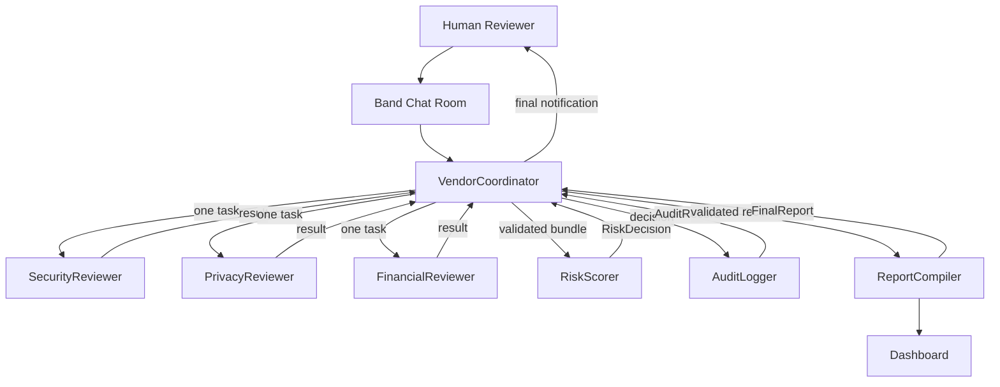

# VendorVigil -- Architecture Document

## System Overview

VendorVigil is a **Band-native multi-agent system** for enterprise vendor risk triage.
Seven specialized AI agents collaborate through Band Chat Room via sequential @mention routing,
with runtime enforcement guards ensuring correct workflow behavior.

## Runtime Enforcement Architecture

Dynamic routing is visible through agents marked as SKIPPED based on the RoutingPlan.

## Runtime Enforcement Layers

| Layer | Component | Purpose |
|---|---|---|
| **Workflow State** | `utils/workflow_state.py` | Sequential stage machine, persisted state, per-workflow locks |
| **Inbound Guard** | `utils/inbound_guard.py` | Silence-by-default routing, interaction mode classification |
| **Outbound Guard** | `utils/outbound_guard.py` | Policy validation, runtime recipient determination, content sanitization |
| **Handle Resolver** | `utils/handle_resolver.py` | Logical role to Band transport handle mapping |
| **Action Policy** | `utils/action_policy.py` | Role-based permission matrix |
| **Provider Preflight** | `utils/provider_preflight.py` | Pre-launch credential and model validation |

## Technology Classification

| Component | Classification | Role |
|-----------|---------------|------|
| **Band** | Coordination layer | @mention routing, chat room, sequential agent handoff |
| **Band SDK** | Remote Agent SDK | WebSocket connection, 7 Remote Agents registered |
| **Pydantic AI** | Agent framework | Structured output, type-safe agent logic |
| **DigitalOcean** | Provider/gateway | Llama 3.3 70B, DeepSeek V4 Flash |
| **Google AI Studio** | Provider/gateway | Gemini 2.5 Flash for privacy, risk, audit |
| **Featherless** | Provider/gateway | Qwen3.6 models for financial and report |

## Agent Details

| # | Logical Role | Framework | Model | Provider | Role |
|---|---|---|---|---|---|
| 1 | VendorCoordinator | Pydantic AI | `deepseek-4-flash` | DigitalOcean | Sequential workflow controller |
| 2 | SecurityReviewer | Pydantic AI | `llama3.3-70b-instruct` | DigitalOcean | Security assessment |
| 3 | PrivacyReviewer | Pydantic AI | `gemini-2.5-flash` | Google | Privacy assessment |
| 4 | FinancialReviewer | Pydantic AI | `Qwen/Qwen3.6-27B` | Featherless | Financial assessment |
| 5 | RiskScorer | Pydantic AI | `gemini-2.5-flash` | Google | Scoring + fail-closed rules |
| 6 | AuditLogger | Pydantic AI | `Qwen/Qwen3-32B` | Featherless | Immutable audit trail |
| 7 | ReportCompiler | Pydantic AI | `Qwen/Qwen3.6-35B-A3B` | Featherless | Final report generation |

## Sequential Workflow

The coordinator controls all workflow transitions. Only one agent is active at a time:

1. Human requests assessment -> Coordinator creates RoutingPlan
2. Coordinator dispatches SecurityReviewer (if required) -> waits for result
3. Coordinator dispatches PrivacyReviewer (if required) -> waits for result
4. Coordinator dispatches FinancialReviewer (if required) -> waits for result
5. Coordinator dispatches RiskScorer -> waits for RiskDecision
6. Coordinator dispatches AuditLogger -> waits for AuditRecord
7. Coordinator dispatches ReportCompiler -> waits for FinalReport
8. Coordinator sends final notification to human requester

Agents not required by the RoutingPlan are marked as SKIPPED.

## Direct Agent Chat

Specialist agents can also be called directly by humans:
- Casual chat: responds naturally within domain expertise
- Direct domain request: performs domain-specific assessment only
- Does NOT trigger full workflow or call other agents

## Scoring Engine

**Weights**: Security 35% | Privacy 30% | Financial 20% | Evidence 15%

**Status thresholds**:
- APPROVED (80-100): Vendor may proceed to contract
- NEEDS_REVISION (65-79): Complete missing evidence first
- ESCALATED (45-64): Mandatory human review required
- TEMPORARILY_REJECTED (0-44): Not yet eligible

**7 Fail-Closed Rules** (can only escalate, never downgrade):
1. Personal data + no DPA -> ESCALATED
2. Payment processing + no SOC 2 -> ESCALATED
3. No ISO 27001 + no encryption -> ESCALATED
4. Two domain sub-scores below 50 -> ESCALATED
5. Total score below 45 -> TEMPORARILY_REJECTED
6. Agent confidence below 0.75 -> ESCALATED
7. Incomplete input -> never APPROVED

## Provider Distribution

- **DigitalOcean** (2 agents): coordinator, security
- **Google AI Studio** (2 agents): privacy, risk
- **Featherless** (3 agents): financial, audit, report

## Golden Path

CloudPayX -> processes personal data and payments -> SOC 2 missing, DPA missing
-> fail-closed ESCALATED -> human review required -> audit ID created
-> final report available.
